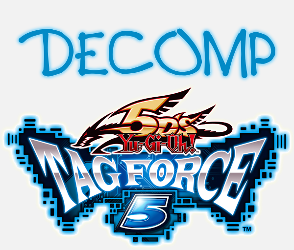

<p align="center">
  
</p>

# Tag Force 5 Decompilation

A **matching decompilation** of *Yu-Gi-Oh! 5D's Tag Force 5* for the PSP
(disc **ULES-01474**, Konami, 2010, MIPS Allegrex CPU).

The goal is to reconstruct the game's C source by hand so that, recompiled with the
original toolchain, it produces **byte-for-byte identical** binaries — and from there to
understand, fix, and extend the game (starting with the duel logic, which is hardcoded
in the code rather than in data).

> This is the **first known decompilation effort for any Tag Force game.** It is early
> and there is a lot to do — contributions are very welcome (see
> [Contributing](#contributing)).

## ⚠️ Legal

- **No copyrighted content is stored in this repository.** ISOs, `.prx` files, the
  EBOOT, and extracted assets are all excluded by `.gitignore`. You must provide your
  own legally-obtained copy of the game to extract the files.
- Only hand-written reconstructed source, tooling, and documentation live here.
- Mods are distributed as patches (xdelta), never as complete ISOs.

## Status

Setup is complete and the **decompilation has started**. `rel_movie_viewer` (the
smallest module, 26 KB) is fully split with a complete section-accurate splat config,
and **15 of its 16 `.text` functions are matched at 100%** (see
[`src/rel_movie_viewer.c`](src/rel_movie_viewer.c), functions tagged `MATCH 100%`).

Matching can now be verified **entirely locally** (no decomp.me account needed):
`wibo` + a real `mwccpsp_3.0.1_219` binary compile candidate C, and
`scripts/mwcc_diff.py` diffs the result against splat's target asm the same way
decomp.me does — treating relocated words (globals/calls) as equal when they
reference the same symbol, regardless of the actual baked address. See
[`docs/06-splitting-and-matching.md`](docs/06-splitting-and-matching.md) "Local
matching".

**Confirmed compiler configuration**

| Setting | Value |
|---|---|
| Original compiler | Metrowerks CodeWarrior for PSP — `MW MIPS C Compiler (2.4.1.01)` |
| decomp.me / build | **MWCC 1.3 SP7** (`mwccpsp_3.0.1_219`) — bisected against all 11 builds: 121–151 ruled out, 192–219 indistinguishable (`scripts/mwcc_bisect.sh`) |
| Flags | **`-O4,s -sdatathreshold 0`** (optimize for SIZE; `-O4,p` was documented until 2026-08-16 and is wrong — see [`docs/09`](docs/09-first-match.md)) |
| Key technique | game state globals are **`volatile`**, accessed via a local pointer (see [`docs/09-first-match.md`](docs/09-first-match.md)) |

What is already established:

- **28 `rel_*.prx` game modules are plain Allegrex ELF** → analyzable immediately.
- **EBOOT.BIN decrypted** → `build/EBOOT.elf` (the shared `modehsys` engine).
  `BOOT.BIN` is a zeroed dummy.
- Full pipeline proven end-to-end, **including a local, no-decomp.me matching loop**:
  ISO extraction → EBOOT decryption → Allegrex disassembly (rabbitizer) → **splat**
  producing labeled asm + a full section-accurate linker script → **mwccpsp (via
  wibo) + relocation-aware objdump diff** → 100% match, verified for 9 functions.

## How it works

```
ISO ──extract_iso.sh──► iso_extracted/
EBOOT.BIN (~PSP) ──decrypt_eboot.sh──► build/EBOOT.elf
PRX / EBOOT.elf
   ──Ghidra + ghidra-allegrex / prxtool──►  understand code, resolve NID imports
   ──splat (config/*.yaml)──►  asm/  +  linker script
   ──m2c──►  draft C in src/*.c
   ──mwccpsp + asm-differ / decomp.me──►  byte-exact match
   ──build + sha1sum vs checksums.sha1──►  verify
```

Details for every stage live in [`docs/`](docs/) — see the index below.

## Repository layout

```
README.md              this file
CONTRIBUTING.md        how to help
docs/                  full documentation (English)
scripts/               setup_tools.sh, extract_iso.sh, decrypt_eboot.sh, run_ghidra.sh
config/                splat configs (rel_movie_viewer.yaml = full, section-accurate config)
src/                   reconstructed C source (matched functions)
requirements.txt       Python toolchain (splat / spimdisasm / rabbitizer)
checksums.sha1         sha1 of the original modules (match targets)
.claude/skills/        Claude Code skills for this project
.gitignore             excludes ISO / assets / binaries / build output

# generated / git-ignored (never committed):
iso_extracted/  tools/  .venv/  build/  asm/
```

## Quick start

```bash
# 1. system dependencies (once)
sudo apt install -y p7zip-full build-essential libssl-dev python3-venv cmake ninja-build

# 2. project toolchain (venv + git tools)
scripts/setup_tools.sh

# 3. extract the disc (use YOUR own ISO)
scripts/extract_iso.sh "path/to/your.iso"

# 4. decrypt the EBOOT (shared modehsys engine)
make -C tools/pspdecrypt            # after libssl-dev
scripts/decrypt_eboot.sh

# 5. split a module
. .venv/bin/activate
splat split config/rel_movie_viewer.yaml

# 6. (optional) local matching, no decomp.me account needed —
#    setup_tools.sh already fetched wibo + mwccpsp_3.0.1_219 into tools/;
#    a MIPS objdump is the one thing you still need system-wide:
sudo apt install -y binutils-mips-linux-gnu
scripts/mwcc_build.sh src/rel_movie_viewer.c
scripts/mwcc_diff.py asm/rel_movie_viewer/text.s build/mwcc/rel_movie_viewer.o
```

Ghidra + the ghidra-allegrex extension and PPSSPP are installed manually — see
[`docs/03-tools.md`](docs/03-tools.md). Launch Ghidra with `scripts/run_ghidra.sh`.

## Documentation

1. [`docs/01-overview.md`](docs/01-overview.md) — what a matching decompilation is, the workflow, legal notes, expectations
2. [`docs/02-iso-analysis.md`](docs/02-iso-analysis.md) — disc structure, modules, identified compiler
3. [`docs/03-tools.md`](docs/03-tools.md) — installing the toolchain on Linux
4. [`docs/04-extraction-and-decryption.md`](docs/04-extraction-and-decryption.md) — extracting the ISO, decrypting the EBOOT
5. [`docs/05-ghidra.md`](docs/05-ghidra.md) — analysis with Ghidra + ghidra-allegrex, NIDs
6. [`docs/06-splitting-and-matching.md`](docs/06-splitting-and-matching.md) — splitting, m2c, asm-differ, decomp.me, mwccpsp
7. [`docs/07-file-formats.md`](docs/07-file-formats.md) — asset formats (EHP / CIP / card DB / audio / models)
8. [`docs/08-resources.md`](docs/08-resources.md) — links, community, reference project (sotn-decomp)
9. [`docs/09-first-match.md`](docs/09-first-match.md) — **hands-on tutorial**: the first match on decomp.me

## Contributing

Help is very welcome — this is a big, long-term effort and every matched function
counts. See **[CONTRIBUTING.md](CONTRIBUTING.md)** for the full guide. In short:

1. Read [`docs/01-overview.md`](docs/01-overview.md) and
   [`docs/09-first-match.md`](docs/09-first-match.md).
2. Get set up with `scripts/setup_tools.sh` and extract your own copy of the game.
3. Pick a small, unclaimed function (the `rel_movie_viewer` module is a good starting
   point) and match it on [decomp.me](https://decomp.me) with the confirmed config above.
4. Open a PR adding the matched C to `src/`.

The single most useful reference project is
[**sotn-decomp**](https://github.com/Xeeynamo/sotn-decomp) — the only mature PSP
matching decompilation, and it uses the same toolchain.

## Acknowledgements

Built on the work of the PSP reverse-engineering and decomp communities:
[splat](https://github.com/ethteck/splat), [m2c](https://github.com/matt-kempster/m2c),
[asm-differ](https://github.com/simonlindholm/asm-differ),
[decomp.me](https://decomp.me), [ghidra-allegrex](https://github.com/kotcrab/ghidra-allegrex),
[pspdecrypt](https://github.com/John-K/pspdecrypt),
and the [Tag Force modding community](https://github.com/xan1242).

## License

The reconstructed source and tooling in this repository are released under the terms in
[LICENSE](LICENSE). This project is not affiliated with or endorsed by Konami. All game
content and trademarks belong to their respective owners.
